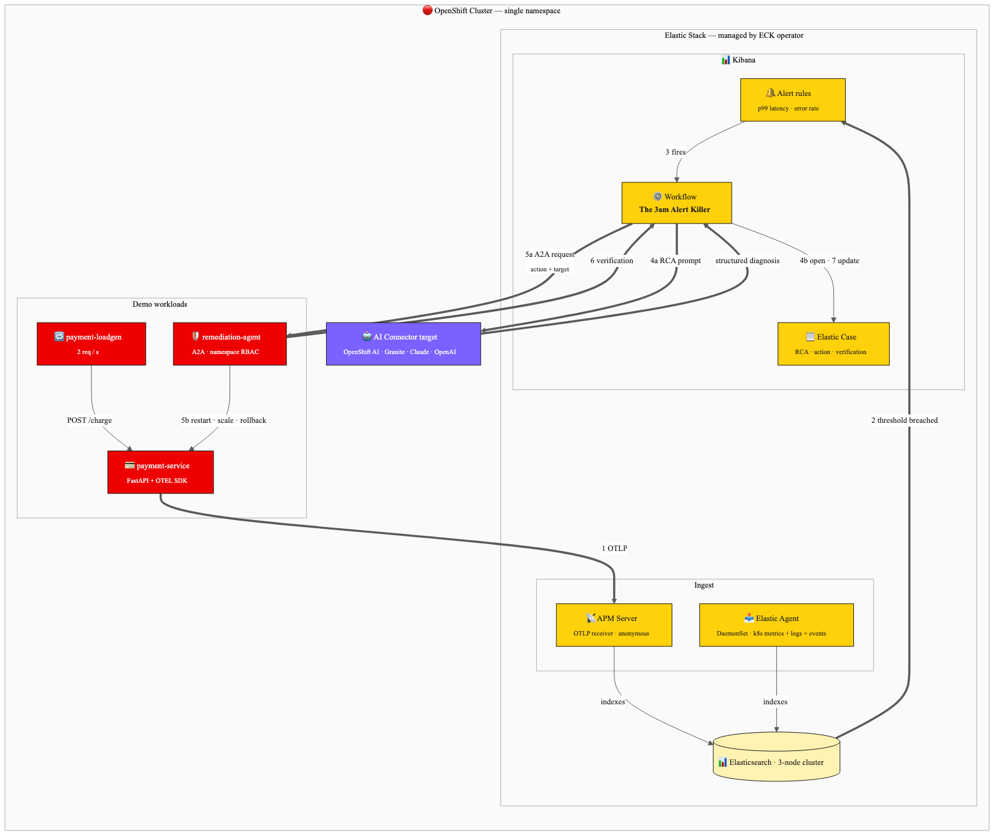

# Deploy Autonomous SRE with Elastic and OpenShift AI

Eliminate 3am firefighting when payments fail: AI-driven root cause analysis and A2A-protocol remediation on OpenShift with the Elastic Stack via ECK.

## Table of Contents

- [Detailed Description](#detailed-description)
  - [See it in action](#see-it-in-action)
  - [Architecture](#architecture)
- [Requirements](#requirements)
  - [Minimum hardware requirements](#minimum-hardware-requirements)
  - [Minimum software requirements](#minimum-software-requirements)
  - [Required user permissions](#required-user-permissions)
- [Deploy](#deploy)
  - [1. Log into OpenShift](#1-log-into-openshift)
  - [2. Install the ECK operator](#2-install-the-eck-operator-cluster-admin-one-time)
  - [3. Build the application images](#3-build-the-application-images)
  - [4. Install the Helm chart](#4-install-the-helm-chart)
  - [5. Start the 30-day Elastic trial license](#5-start-the-30-day-elastic-trial-license)
  - [6. Set up Kibana, the AI connector, and alerts](#6-set-up-kibana-the-ai-connector-and-alerts)
  - [7. Deploy the Elastic workflow](#7-deploy-the-elastic-workflow)
  - [8. Run the demo](#8-run-the-demo)
  - [Delete](#delete)
  - [Makefile shortcuts](#makefile-shortcuts)
- [Repository Structure](#repository-structure)
- [Reference](#reference)
- [Tags](#tags)

## Detailed Description

Modern digital platforms operate at massive scale — tens of thousands of transactions per second. When a critical service fails at 3am, the traditional approach of manually triaging dashboards, correlating logs, and diagnosing root causes is slow, error-prone, and stressful for on-call engineers.

This quickstart demonstrates how the **Elastic Stack** (deployed on OpenShift via [Elastic Cloud on Kubernetes](https://www.elastic.co/elastic-cloud-kubernetes), or ECK) and **Red Hat OpenShift AI** work together to transform incident response from reactive firefighting into autonomous remediation. Every component runs inside your OpenShift cluster — no SaaS dependencies. The system uses a multi-agent approach:

1. **ECK-managed Elastic Agent** continuously collects Kubernetes metrics, container logs, and events from every node and ships them to the in-cluster Elasticsearch cluster.
2. **ECK-managed APM Server** receives OpenTelemetry traces, metrics, and logs from the demo application over OTLP/HTTP.
3. **Elastic Workflows** orchestrates the incident-response pipeline. When an APM alert fires in Kibana, the workflow automatically enriches the alert with correlated Kubernetes events and pod logs.
4. **AI-powered Root Cause Analysis** uses an LLM (IBM Granite served on OpenShift AI, or any OpenAI-compatible endpoint) wired through Kibana's AI Connector. The LLM analyzes the collected evidence and produces a structured diagnosis with confidence scores and a recommended action.
5. **A2A Remediation Agent** receives the AI-determined action via the [Agent-to-Agent (A2A) protocol](https://github.com/google/A2A) and executes Kubernetes operations — restart deployments, scale replicas, or roll back — then verifies the fix.
6. **Elastic Cases** captures the full audit trail: original alert, RCA narrative, remediation action, verification result.

The demo includes a simulated `payment-service` (FastAPI with controllable failure injection: latency spikes, OOM crashes) and a load generator that produces realistic transaction traffic so you can fire a real alert end-to-end in minutes.

### See it in action

> An Arcade walkthrough is planned and will be linked here. For now, the [Deploy](#deploy) section walks through the full demo path including the failure-injection commands.

### Architecture



The entire stack — Elasticsearch, Kibana, APM Server, Elastic Agent, the demo workloads, and the A2A remediation agent — lives in a single OpenShift namespace, managed by the ECK operator and the Helm chart in this repo.

## Requirements

### Minimum hardware requirements

ECK runs a 3-node Elasticsearch cluster plus Kibana, APM Server, and a per-node Elastic Agent DaemonSet. The cluster needs meaningfully more capacity than a Sandbox can provide.

| Resource | Specification |
|----------|---------------|
| OpenShift cluster | ROSA, OpenShift on AWS/GCP/Azure, or self-managed OpenShift 4.14+. **Developer Sandbox is not supported** (CRDs, ClusterRoles, and DaemonSets are restricted). |
| vCPU | 6 vCPU available for workloads (3 ES nodes × ~0.5 vCPU + Kibana + APM + agent + demo). Recommend 8+ vCPU. |
| Memory | 12 GB available for workloads (3 ES nodes × 2 GB + Kibana 1 GB + APM 1 GB + agent 1 GB + demo). Recommend 16 GB. |
| Storage | 150 GB total of `ReadWriteOnce` PVC (50 GB × 3 ES nodes). Default storage class must support `ReadWriteOnce`. |
| GPU | Not required. The LLM is reached via the Kibana AI Connector — IBM Granite served on OpenShift AI, or any OpenAI-compatible endpoint. |

### Minimum software requirements

| Software | Version | Notes |
|----------|---------|-------|
| OpenShift | 4.14+ | Tested with OpenShift 4.14 and ROSA 4.16. |
| `oc` CLI | 4.14+ | [Install guide](https://mirror.openshift.com/pub/openshift-v4/clients/ocp/stable/) |
| Helm | 3.14+ | Required for chart-based deploy. |
| ECK operator | 2.13+ | Installed via OperatorHub / OLM. See deploy step 2. |
| `curl` | any | For triggering failure scenarios and testing endpoints. |
| `python3` | 3.11+ | Optional, for local development of the agents. |
| Elastic trial license | 30-day trial | The AI Connector and Elastic Workflows require subscription features. Self-activated in [deploy step 5](#5-start-the-30-day-elastic-trial-license); no Elastic account or signup needed. |

### Required user permissions

- **Red Hat account** with **cluster-admin** access to install the ECK operator. Operator installation is a one-time, cluster-wide step that can be performed by a platform team and reused across many quickstart deployments.
- **LLM access**, one of:
  - IBM Granite served on Red Hat OpenShift AI (in-cluster, GPU node required).
  - Any OpenAI-compatible inference endpoint reachable from inside the cluster.
  - An external SaaS endpoint (Anthropic, OpenAI, Azure OpenAI). Egress required.

> No Elastic Cloud account is required — Elasticsearch and Kibana run inside your OpenShift cluster. The subscription features this demo uses (AI Connector, Elastic Workflows) are unlocked with a self-activated 30-day trial license in [deploy step 5](#5-start-the-30-day-elastic-trial-license); no signup or license key needed.

## Deploy

### 1. Log into OpenShift

```bash
oc login --token=<YOUR_TOKEN> --server=https://api.<CLUSTER_DOMAIN>:6443
oc new-project easre || oc project easre
```

### 2. Install the ECK operator (cluster-admin, one-time)

The chart deploys ECK *Custom Resources* (Elasticsearch, Kibana, ApmServer, Agent). The operator that reconciles them must already be installed cluster-wide.

```bash
oc apply -f manifests/eck-operator.yaml
```

This creates an OLM Subscription in `openshift-operators` for the `elastic-cloud-eck` community operator. Wait until the CRDs land:

```bash
until oc get crd elasticsearches.elasticsearch.k8s.elastic.co >/dev/null 2>&1; do
  echo "Waiting for ECK CRDs..."; sleep 5
done
```

If you prefer to install ECK manually from upstream YAML instead of OLM, follow [the official ECK quickstart](https://www.elastic.co/guide/en/cloud-on-k8s/current/k8s-deploy-eck.html) — the chart works with either install method.

### 3. Build the application images

The chart references three application images. Easiest on OpenShift is binary builds, which push to the in-cluster registry:

```bash
NAMESPACE=$(oc project -q)

for app in payment-service payment-loadgen remediation-agent; do
  oc new-build --name=$app --binary --strategy=docker --namespace=$NAMESPACE -l app=$app || true
  oc start-build $app --from-dir=./$app --namespace=$NAMESPACE --follow
done
```

### 4. Install the Helm chart

```bash
helm install easre ./chart --namespace $NAMESPACE
```

This deploys, in order: the Elasticsearch cluster, Kibana, APM Server, the Elastic Agent DaemonSet, then the three demo workloads. ECK takes a few minutes to bootstrap — Elasticsearch must reach `green` health before Kibana and APM start.

Watch the stack come up:

```bash
oc get elasticsearch,kibana,apmserver,agent
oc get pods -l app.kubernetes.io/part-of=elastic-autonomous-sre
```

When everything is `Ready`, retrieve the Kibana credentials and route:

```bash
KIBANA_URL="https://$(oc get route kibana -o jsonpath='{.spec.host}')"
KIBANA_USER="elastic"
KIBANA_PASS="$(oc get secret elastic-stack-es-elastic-user -o jsonpath='{.data.elastic}' | base64 -d)"

echo "Kibana: $KIBANA_URL  user: $KIBANA_USER  pass: $KIBANA_PASS"
```

> Kibana is served with a self-signed certificate (passthrough route). Your browser will warn on first visit; accept it for the demo. Replace with a real cert via `eck.kibana.route` overrides for production.

Verify payment-service is shipping APM data:

```bash
oc logs -l app=payment-service --tail=20 | grep -i otel
```

You should see traces appearing within ~30 s in Kibana → **Observability → APM → Services**.

### 5. Start the 30-day Elastic trial license

ECK deploys Elasticsearch with the free **Basic** license. The AI Connector (step 6) and Elastic Workflows (step 7) require subscription features, so start the built-in 30-day trial before continuing. The trial unlocks all subscription features, requires no Elastic account, and is activated directly against your in-cluster Elasticsearch using the [start trial API](https://www.elastic.co/docs/api/doc/elasticsearch/operation/operation-license-post-start-trial).

**Option A — Kibana UI.** Log into Kibana with the credentials from step 4, then go to **Stack Management → License Management** and click **Start a 30-day trial**.

**Option B — API.** Elasticsearch is not exposed via a route, so port-forward to it and call the API as the `elastic` user. The `acknowledge=true` parameter is required:

```bash
oc port-forward service/elastic-stack-es-http 9200:9200 >/dev/null 2>&1 &
PF_PID=$!
sleep 3

curl -sk -u "elastic:${KIBANA_PASS}" -X POST \
  "https://localhost:9200/_license/start_trial?acknowledge=true"

kill $PF_PID
```

Or simply:

```bash
make start-trial
```

A successful response looks like:

```json
{"acknowledged": true, "trial_was_started": true}
```

You can confirm the active license at any time with `GET /_license` (via the same port-forward, or Kibana → **Dev Tools**) — `license.type` should now be `trial`.

> **Trial notes:**
> - The trial lasts **30 days**. When it expires the cluster reverts to Basic — your data is untouched, but the AI Connector and Workflows stop working. Extended trials are available at [elastic.co/trialextension](https://www.elastic.co/trialextension).
> - Elasticsearch allows **one trial per major version**. If the response says `"trial_was_started": false` with an error message, this cluster has already consumed its trial. Since this quickstart creates a fresh Elasticsearch cluster, a new deployment always has a fresh trial available.
> - The API call requires the `manage` cluster privilege; the built-in `elastic` superuser used above has it.

### 6. Set up Kibana, the AI connector, and alerts

In Kibana → **Stack Management → Connectors**, create an AI connector:
- Type: **OpenAI** (compatible) for IBM Granite served via OpenShift AI, or **Anthropic** / **OpenAI** for SaaS models.
- For OpenShift AI Granite, the URL is the in-cluster route to your model serving runtime (e.g. `https://granite-7b.<ai-namespace>.svc.cluster.local:8080/v1`).
- Note the connector name — you'll reference it in the workflow YAML.

> If the AI connector types don't appear, the trial license from step 5 hasn't been activated — go back and start it first.

In Kibana → **Observability → Alerts → Manage Rules**, create:

| Rule | Type | Threshold | Window |
|------|------|-----------|--------|
| Payment Service – High p99 Latency | APM Transaction Duration | p99 > 3000ms | 2 min |
| Payment Service – Error Rate Spike | APM Transaction Error Rate | > 10 % | 2 min |

### 7. Deploy the Elastic workflow

Edit `workflows/3am-alert-killer.yaml` and replace these three placeholder tokens (they appear multiple times each — replace every occurrence):

- `AI_CONNECTOR_ID` → the ID of your AI connector from step 6. Find it in Kibana → **Stack Management → Connectors** → open the connector; the ID is in the URL and on the connector detail page.
- `REMEDIATION_AGENT_URL` → the in-cluster service URL: `http://remediation-agent.<your-namespace>.svc.cluster.local:8080`
- `NAMESPACE` → your OpenShift namespace (e.g. `easre`)

A quick way to fill them in from the repo root:

```bash
sed -i '' \
  -e "s|AI_CONNECTOR_ID|<your-connector-id>|g" \
  -e "s|REMEDIATION_AGENT_URL|http://remediation-agent.${NAMESPACE}.svc.cluster.local:8080|g" \
  -e "s|NAMESPACE|${NAMESPACE}|g" \
  workflows/3am-alert-killer.yaml
```

> Replace `NAMESPACE` **last**, as shown above, so it doesn't partially match the other tokens. Then open the file and confirm all three are filled in before applying.

Apply via the Kibana API. Mint an Elasticsearch API key first (Kibana → **Stack Management → API keys → Create API key**):

```bash
API_KEY="<YOUR_KIBANA_API_KEY>"

curl -sk -X POST "${KIBANA_URL}/api/workflows?overwrite=true" \
  -H "Authorization: ApiKey ${API_KEY}" \
  -H "kbn-xsrf: true" \
  -H "Content-Type: application/json" \
  --data-binary @<(jq -Rs --arg yaml "$(cat workflows/3am-alert-killer.yaml)" '{workflows: [{yaml: $yaml}]}' <<< '')
```

Or paste the YAML directly into **Kibana → Workflows → Create new workflow**.

### 8. Run the demo

**Steady state.** Open Kibana → **APM → Services → payment-service**. You should see traffic at ~55 ms p99.

**Trigger an incident:**

```bash
PAYMENT_ROUTE=$(oc get route payment-service -o jsonpath='{.spec.host}')
curl -sk -X POST "https://${PAYMENT_ROUTE}/admin/fail/latency?delay_ms=5000"
```

**Watch the autonomous response.** Within 1–2 minutes:

1. APM latency spikes to ~5 s.
2. The "High p99 Latency" rule fires.
3. The workflow runs: enrich → RCA → create case → dispatch A2A → verify.
4. A new Elastic Case appears with the full RCA, the action taken, and verification.

**Reset:**

```bash
curl -sk -X POST "https://${PAYMENT_ROUTE}/admin/fail/clear"
```

**Other failure modes:**

```bash
curl -sk -X POST "https://${PAYMENT_ROUTE}/admin/fail/oom"
```

### Delete

```bash
helm uninstall easre --namespace $NAMESPACE

# The Elasticsearch PVCs are NOT deleted by helm uninstall (data preservation).
# Remove them explicitly if you want a clean slate:
oc delete pvc -l elasticsearch.k8s.elastic.co/cluster-name=elastic-stack -n $NAMESPACE

# Clean up BuildConfigs and ImageStreams from step 3:
oc delete bc payment-service payment-loadgen remediation-agent --ignore-not-found
oc delete is payment-service payment-loadgen remediation-agent --ignore-not-found

# Optionally uninstall the ECK operator (cluster-admin) — only if you have no
# other ECK-managed stacks in the cluster:
oc delete -f manifests/eck-operator.yaml
```

To remove the workflow from Elastic, delete it via Kibana → **Workflows** or `DELETE ${KIBANA_URL}/api/workflows/<id>`.

### Makefile shortcuts

The repo ships with a Makefile that wraps the entire lifecycle. Run `make help` for the menu. Common flows:

```bash
make eck-operator       # apply manifests/eck-operator.yaml + wait for CRDs
make deploy             # build images + helm install + show status
make kibana-creds       # print Kibana URL, user, and password
make start-trial        # start the 30-day Elasticsearch trial license (deploy step 5)
make inject-latency     # fire the demo (DELAY_MS=8000 to override)
make inject-oom         # alternate failure mode
make logs-agent         # tail the remediation-agent
make reset              # clear all injected failures
make clean              # helm uninstall + remove builds (keeps PVCs)
make clean-all          # clean + delete Elasticsearch PVCs
make diagram            # render docs/images/architecture.mmd to PNG
```

## Repository Structure

```
.
├── chart/                       # Helm chart (primary deployment path)
│   ├── Chart.yaml
│   ├── values.yaml
│   └── templates/
│       ├── eck-elasticsearch.yaml
│       ├── eck-kibana.yaml
│       ├── eck-apm.yaml
│       ├── eck-agent.yaml
│       ├── payment-service.yaml
│       ├── payment-loadgen.yaml
│       └── remediation-agent.yaml
├── manifests/
│   └── eck-operator.yaml        # OLM Subscription (cluster-admin, prerequisite)
├── payment-service/             # FastAPI app with OpenTelemetry + failure injection
├── payment-loadgen/             # Continuous load generator
├── remediation-agent/           # A2A-protocol agent that performs kubectl actions
├── workflows/
│   └── 3am-alert-killer.yaml    # Elastic workflow definition
├── scripts/
│   ├── deploy.sh                # End-to-end deploy: build images + helm install
│   └── delete.sh                # Tear down everything
├── docs/images/                 # Architecture diagram and screenshots
└── .github/workflows/           # CI: helm lint + chart-template validation
```

## Reference

- [Elastic Cloud on Kubernetes (ECK)](https://www.elastic.co/guide/en/cloud-on-k8s/current/index.html)
- [ECK on OperatorHub](https://operatorhub.io/operator/elastic-cloud-eck)
- [Elastic Workflows](https://www.elastic.co/docs/explore-analyze/workflows)
- [Elastic Observability](https://www.elastic.co/observability)
- [Agent-to-Agent (A2A) Protocol](https://github.com/google/A2A)
- [Red Hat OpenShift AI](https://www.redhat.com/en/technologies/cloud-computing/openshift/openshift-ai)
- [IBM Granite Models](https://www.ibm.com/granite)

## Tags

* **Industry:** Banking and securities
* **Product:**  OpenShift AI, OpenShift 
* **Partners:** Elastic
* **Use case:** Autonomous SRE, Incident Response, AIOps 
* **Topic:** Observability, Agentic AI, Multi-Agent Systems 
